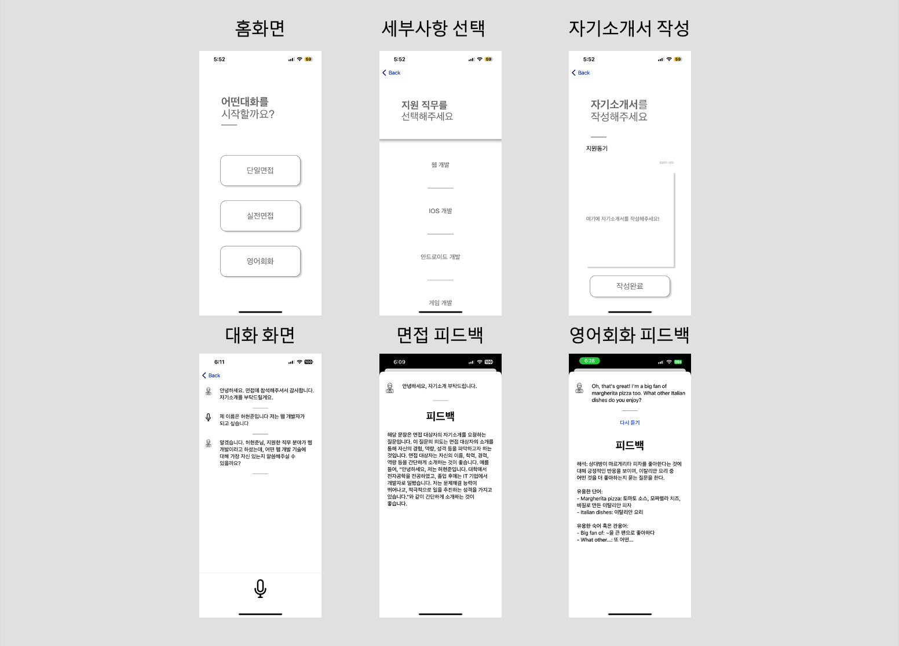
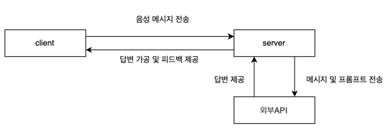
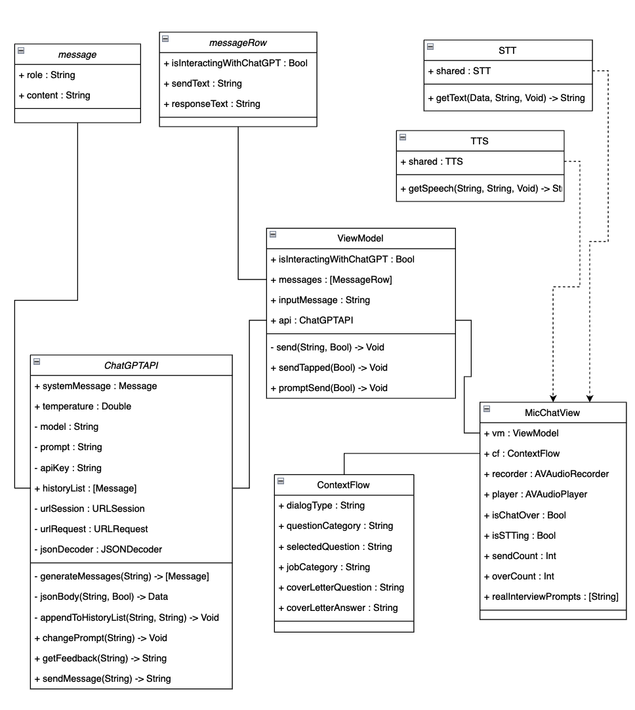
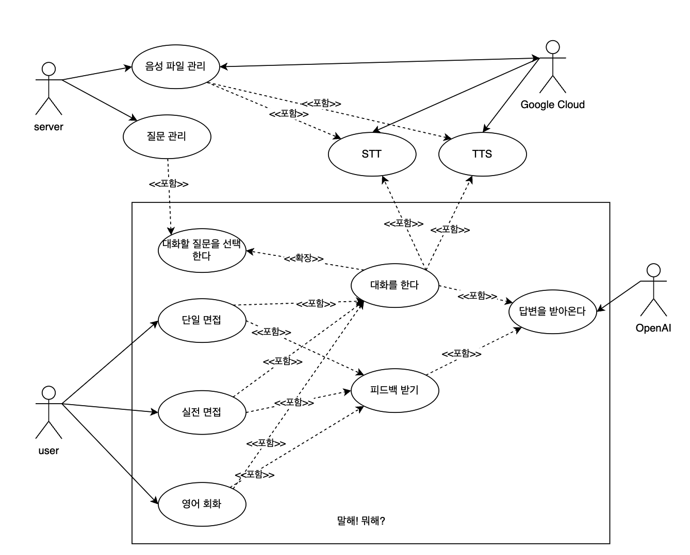

# 말해뭐해
학위논문 [모의 면접 및 영어 커뮤니케이션을 위한 대화형 인공지능 기반 애플리케이션](https://gjguswns.synology.me:10003/d/s/z7NurcG31ypAkgDWF6Jy4EI2wKqJ2D6S/xc0yiL0q_WxsvL1e3zy05ZN1Tzr-pcTv-a7qAI_Q43gs)에서 사용된 어플리케이션입니다.

# 결과

- [단일면접 유튜브](https://youtube.com/shorts/kIc-BpS6UE4?feature=share)
- [실전면접 유튜브](https://youtu.be/Gi40UinxMEY)
- [영어회화 유튜브](https://youtu.be/XJKW4cpnrIo)

# 역할
권 해 [@SuperSun](https://github.com/rnjsgo)
- 자료 조사 및 데이터 수집(공통)          
- DataBase 구축 
- Application UI 설계                         
- 서버구축

허현준 [@HEO-hyunjun](https://github.com/HEO-hyunjun)
- 자료 조사 및 데이터 수집(공통)          
- API통신
- 세부기능구현                                  
- 프롬프트 작성

# 시스템 개요

## 클래스다이어그램

## 유스케이스 다이어그램

# 구현 환경
- Application
  - 개발 언어 Swift
  - 개발 환경 Xcode

- Server
  - 개발 언어 : Java
  - 개발 환경 : Spring
  - DBMS : MySQL

- 대형 언어 모델(LLM) : GPT-3.5-Turbo
- TTS & STT API : Google Cloud
- 형상관리 : Git
- 협업도구 : Notion

### 참조
- 이 프로젝트는 다음 [레포지토리](https://github.com/alfianlosari/ChatGPTSwiftUI)를 참조했습니다. 
